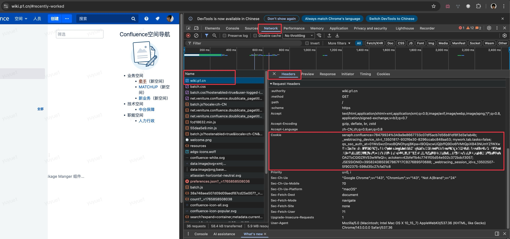

# WikiMCP

一个用于访问 Confluence Wiki 的工具，支持 **MCP** 和 **Agent Skill** 两种方式接入。

## 为什么开发这个工具？

在日常工作中，我们经常需要让 AI 帮助理解和分析公司内部 Wiki 文档。然而，传统的方式存在诸多问题：

- **截图传递不准确**：将 Wiki 页面截图发送给 AI，图片中的文字识别（OCR）可能出错，尤其是表格、代码块等复杂内容
- **PDF 导出效果差**：手动导出 PDF 再上传，AI 对 PDF 解析，准确度依然不够, 且不包含 wiki 文档的评论内容
- **手动操作繁琐**：每次都要截图/导出/上传，流程冗长，影响工作效率

**WikiMCP** 通过直接调用 Confluence API，将 Wiki 页面, 评论内容转换为结构化的 Markdown 文本，让 AI 能够准确获取原始内容，告别模糊的图片识别，实现真正高效的文档理解与分析。

## 功能

- **wiki_to_md** / **convert**: 将 Wiki 页面转换为 Markdown 格式
- **search_wiki** / **search**: 搜索 Wiki 内容


## 使用示例

### 搜索 Wiki
```
在 wiki 中搜索 Swift
```

### 获取页面内容
```
获取 https://wiki.p1.cn/pages/viewpage.action?pageId=12345
```

### 或者其他更复杂的需求
```
我们的 iOS 项目从 Cocoapods 转向了 SPM, 我想知道有没有相关记录的文档, 帮我在 wiki 中寻找

从 wiki 中寻找见面相关的信息, 帮我总结当前见面需求的情况
```

---

## 下载安装

### 方式一：MCP Server

```bash
# 一键安装
curl -fsSL https://raw.githubusercontent.com/qianshoutech/WikiMCP/main/install.sh | bash
```
#### 配置 MCP 客户端

在 Cursor 或其他 MCP 客户端的配置文件中添加：

```json
{
  "mcpServers": {
    "wikimcp": {
      "command": "~/.local/bin/wikimcp",
      "args": ["chrome"]
    }
  }
}
```

**args 参数说明**：指定从哪个浏览器读取 Cookie，默认为 `chrome`。

支持的浏览器：
- `safari`
- `chrome`, `chromeBeta`, `chromeCanary`
- `arc`, `arcBeta`, `arcCanary`
- `edge`, `edgeBeta`, `edgeCanary`
- `brave`, `braveBeta`, `braveNightly`
- `firefox`, `chromium`, `vivaldi`, `chatgptAtlas`

#### MCP 工具

| 工具 | 描述 | 参数 |
|------|------|------|
| `wiki_to_md` | 转换 Wiki 页面为 Markdown | `url` 或 `pageId` |
| `search_wiki` | 搜索 Wiki 内容 | `query`, `limit`(可选) |

---

### 方式二：Agent Skill

[](https://github.com/qianshoutech/WikiMCP/releases/latest/download/wiki-tool.tar.gz)

下载解压后, 将 `wiki-tool` 文件夹移动到 `~/.claude/skills`, 或项目中的的 `.claude/skills` 目录

目录结构：
```
your-project/
└── skills/
    └── wiki-tool/
        ├── SKILL.md    # Skill 定义
        └── wikicli     # CLI 工具
```

#### CLI 命令

```bash
# 搜索（默认使用 Chrome）
skills/wiki-tool/wikicli search "关键词"

# 转换页面
skills/wiki-tool/wikicli convert "https://wiki.p1.cn/..."

# 使用其他浏览器
skills/wiki-tool/wikicli search "关键词" --browser safari
skills/wiki-tool/wikicli convert "https://wiki.p1.cn/..." --browser edge
```

#### 在 Cursor / Antigravity 中使用 Skill

如果你想在 **Cursor**、**Antigravity**、**GitHub Copilot** 等支持 AI 代理中更好地使用 Skill，可以借助 [SkillPort](https://github.com/gotalab/skillport) 

---

## ⚠️ 首次使用权限配置

本工具会自动从本地浏览器读取 Cookie，首次使用时需要进行以下权限配置：

### Chromium 系浏览器（Chrome、Edge、Arc、Brave 等）

首次运行时，系统会弹出钥匙串访问提示：

> "xxx 想要访问你的钥匙串中的密钥 Chrome Safe Storage"

**请输入密码并选择「始终允许」** 以避免每次运行都弹出提示。


### Safari 浏览器

需要在系统设置中为终端或运行环境开启「完全磁盘访问权限」：

1. 打开「系统设置」→「隐私与安全性」→「完全磁盘访问权限」
2. 添加并启用 Cursor 或你使用的终端应用（如 Warp, iTerm2 等）

---

## Cookie 配置（备用方式）

如果自动读取浏览器 Cookie 不可用，可以使用环境变量方式：

### 如何获取 Cookie

1. 在浏览器中打开 https://wiki.p1.cn 并登录
2. 打开开发者工具 (F12 或 Cmd+Option+I)
3. 切换到 Network 标签
4. 刷新页面，点击任意请求
5. 在 Headers 中找到 `Cookie` 字段并复制完整内容



---


## 项目结构

```
WikiMCP/
├── Sources/
│   ├── WikiCore/          # 核心功能库
│   ├── WikiMCP/           # MCP 服务器
│   └── WikiCLI/           # CLI 工具
├── skills/
│   └── wiki-tool/         # Skill 定义
├── scripts/
│   └── build-release.sh   # 发布构建脚本
└── README.md
```

## 注意事项

1. 需要有效的 Wiki 访问权限（确保浏览器已登录 wiki.p1.cn）
2. Chromium 系浏览器首次使用需要授权钥匙串访问
3. Safari 需要开启完全磁盘访问权限
4. 仅支持 macOS

## License

MIT License
